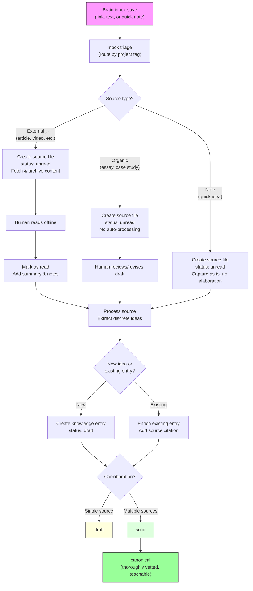

# AI Product Management Craft

A structured learning project to level up as a product manager in the AI/LLM era, and to be able to explain the concepts to others.

## Goal

Build a deep, well-sourced body of knowledge about AI product management — from techniques and mental models to insights about what separates great AI PMs from the rest. Every idea should be traceable back to its sources with quotes, context, and links.

## How This Works

### Source Lifecycle

```
Discover → Capture (unread) → Read → Process → Knowledge Base
```

1. **Discover**: Find an article, video, newsletter, tweet thread
2. **Capture**: Drop in `inbox/` with `project: ai-pm-craft` tag, or create directly in `sources/`
3. **Read**: Mark as `reading` → `read`, add summary and notes
4. **Process**: Extract discrete ideas into knowledge entries with source lineage
5. **Synthesize**: Knowledge entries accumulate citations from multiple sources over time

### Source Types

| Type | Origin | What it is | Processing |
|------|--------|------------|------------|
| `article` | External | Blog post, essay | Full reading lifecycle |
| `video` | External | YouTube, conference talk | Full reading lifecycle |
| `podcast` | External | Audio transcript/notes | Full reading lifecycle |
| `newsletter` | External | Lenny's, Substack, etc. | Full reading lifecycle |
| `tweet-thread` | External | X/Twitter thread | Full reading lifecycle |
| `book-chapter` | External | Book excerpt | Full reading lifecycle |
| `organic` | User-authored | Essays, case studies, reflections | User decides when to process — these are drafts that may still be evolving |
| `note` | User-authored | Quick idea, nascent technique, learning goal | Lighter capture (no Raw Content needed), don't elaborate beyond what's stated |

### Source Files (`sources/`)

Each source is a markdown file with archived content, reading status, and extracted ideas. See `templates/source.md`.

**Status lifecycle**: `unread` → `reading` → `read` → `processed`

### Knowledge Entries (`knowledge/`)

Synthesized ideas organized by type. Each entry is atomic — one idea per file — and tracks lineage back to every source that discusses it. See `templates/knowledge-entry.md`.

**Status lifecycle**: `draft` → `solid` → `canonical`

**Entry types**: `technique`, `mental-model`, `insight`

### System Flow



**Key rule for notes**: A note alone keeps a knowledge entry at `draft`. Promotion to `solid` requires corroboration from an external source or the user substantially fleshing out the idea.

---

## Knowledge Map

*The table of contents for all knowledge entries, organized by two axes: product lifecycle (vertical) and horizontal skills that cut across it.*

---

### Product Lifecycle

*Knowledge organized by stage of building and shipping AI products. These sections are placeholders — see task for @user to provide the product lifecycle framework that reflects how you actually think about this.*

#### Strategy & Vision

*How to set direction for AI products, evaluate opportunities, and make bets.*

#### Shipping & Execution

*How to move AI products from idea to production — scoping, tradeoffs, iteration.*

- [[interactive-prd-writing]] — Templatized rule files + AI follow-up questions to generate thorough PRDs; "junior developer" standard for AI-friendly explicitness
- [[task-list-generation-for-observability]] — Decomposing PRDs into nested task lists for observability, control, and stakeholder engagement surface
- [[stepwise-task-execution]] — One-task-at-a-time execution with pause-and-approve checkpoints; error containment through early detection

#### Evaluation & Measurement

*How to measure AI product quality, define success metrics, handle non-determinism.*

#### User Experience & Design

*Patterns for AI-powered interfaces, managing user expectations, trust calibration.*

---

### Horizontal Skills

*Knowledge that applies regardless of product lifecycle stage — how you work with AI systems and communicate with models.*

#### Prompt Engineering

*Specific patterns, framings, and structures for getting better outputs from AI. These techniques are portable: specific enough to use verbatim, broad enough to apply across contexts.*

- [[be-100x-more-specific]] — Prompting technique that forces AI past vague principles into concrete, actionable standards
- [[my-job-your-job-role-delineation]] — Explicit human/AI responsibility partitioning ("MY job is X, YOUR job is Y") to scope authority and set deliverables
- [[ai-as-writing-coach]] — Structured workflow for using AI to sharpen written communication: thesis validation → blind spots → restructuring

#### Working with Agentic Systems

*How to design your relationship with AI agents — workflows, feedback loops, system design, and collaboration patterns. Not one-shot prompting, but the ongoing process of building, evaluating, and refining AI-assisted systems.*

- [[context-first-development]] — "Slow down to speed up" — the biggest mistake in AI-assisted development is rushing past context
- [[deliberate-context-selection]] — Hand-picking files for LLM context ("glass box") vs. relying on automatic context ("black box")
- [[reverse-engineer-judgment-into-ai]] — Collect before/after examples, have AI discover your implicit criteria, encode into reusable evaluator
- [[scale-manager-expertise-with-ai]] — Automate "0-to-60%" repetitive feedback so managers can focus on deep strategic thinking and mentorship

#### Change Management & Adoption

*How leaders drive adoption of AI-native skills and ways of working. Framing, persuasion, organizational change, training approaches, and techniques for bringing teams and stakeholders along. Sources often embed these insights alongside craft techniques — screen for them explicitly.*

---

### Uncategorized

*Knowledge entries not yet placed in the hierarchy. Review periodically and refile.*

---

## Reading Queue

*Quick view of source status. For full details, see `sources/_index.md`.*

### Currently Reading

*None yet.*

### Up Next (Unread)

- [[2026-02-05-teresa-torres-claude-code-task-management]] — Teresa Torres's Claude Code workflows for task management, research automation, and context libraries (article, Claire Vo / ChatPRD)
- [[2026-02-06-build-ai-product-sense]] — Using Cursor for non-technical work to build AI product sense — RAG, memory, context engineering (newsletter, Tal Raviv & Aman Khan / Lenny's)
- [[2026-02-06-brex-agent-human-ops]] — How Brex redesigns operations with AI: 3-level ops model, agent platform, generalist hiring (article, First Round)
- [[2026-02-06-agent-native-engineering]] — Restructuring engineering orgs around agents as ICs: task levels, code review, token spend (article, Andrew Pignanelli)
- [[2026-02-06-teresa-torres-claude-code-guide]] — Claude Code for non-technical people: comparison with browser/desktop, data portability (article, Teresa Torres / Product Talk)
- [[2026-02-07-zapier-workflows-crm-automation-meeting-prep]] — Zapier MCP workflows for CRM automation, meeting prep, and self-improving feedback loops (article, Claire Vo / ChatPRD)
- [[2026-02-07-iterative-workflow-refinement-with-ai-agents]] — Iterative refinement of AI agent skill files through three rounds of feedback (organic draft, Dudgeon & Claude)

### Read (Awaiting Processing)

- [[2026-02-06-spec-driven-development-no-code-library]] — Spec-only library with zero code; boundaries of spec-driven dev (article, Drew Breunig)
- [[2026-02-06-git-workflows-agentic-era]] — Git subtree + submodule patterns for agentic context sharing (article, organic)

### Recently Processed

- [[2026-02-07-ryan-carson-structured-ai-development]] → [[interactive-prd-writing]], [[task-list-generation-for-observability]], [[stepwise-task-execution]], [[context-first-development]], [[deliberate-context-selection]]
- [[2026-02-07-hilary-gridley-scaling-yourself-custom-gpts]] → [[reverse-engineer-judgment-into-ai]], [[be-100x-more-specific]], [[my-job-your-job-role-delineation]], [[ai-as-writing-coach]], [[scale-manager-expertise-with-ai]]

---

## Progress Log

### 2026-02-07
- Inbox triage: 11 items processed, 8 unique sources added (4 Ryan Carson duplicates merged)
- Processed Ryan Carson source → 5 knowledge entries (interactive-prd-writing, task-list-generation-for-observability, stepwise-task-execution, context-first-development, deliberate-context-selection)
- Processed Hilary Gridley source → 5 knowledge entries (reverse-engineer-judgment-into-ai, be-100x-more-specific, my-job-your-job-role-delineation, ai-as-writing-coach, scale-manager-expertise-with-ai)
- Three rounds of refinement: decomposition guidance → portable prompting patterns → ontology restructure
- Restructured Knowledge Map into two axes: Product Lifecycle (vertical) × Horizontal Skills (Prompt Engineering, Working with Agentic Systems)
- Draft organic source written: "Teaching an AI Agent to Think Like You" (in inbox, awaiting review)
- 10 knowledge entries total across 2 processed sources

### 2026-02-05
- Project structure created
- Templates defined: `source.md`, `knowledge-entry.md`
- First source captured: Teresa Torres / Claire Vo article on Claude Code workflows
- Processing workflows documented

---

## Related

- [[professional-development]] — Parent domain
- Context: `context/professional.md`
- Decision: [[008-source-to-knowledge-pattern]]

---

[← Back to Professional Development](../README.md)
