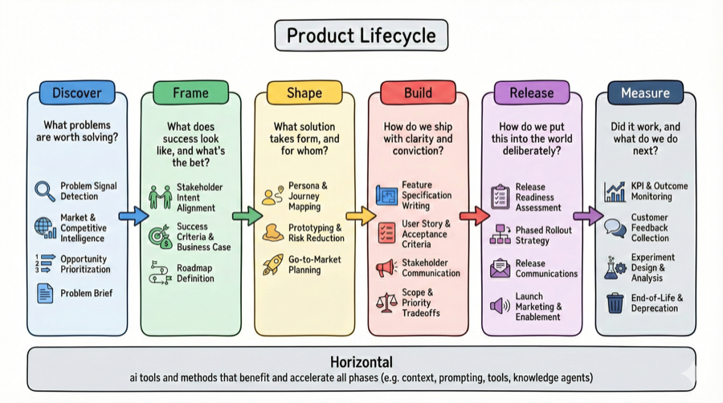

# Knowledge Map

Extracted knowledge organized by domain. Every entry traces back to one or more sources with quotes, context, and links. See `meta/taxonomy.md` for classification rules.

**Entry types**: `technique` · `mental-model` · `insight`
**Entry status**: `draft` → `solid` (multiple sources) → `canonical` (vetted, teachable)

---

## Product Lifecycle

Six phases. Entries sit flat within phase folders; the `component` frontmatter field records the most specific applicable component. See `meta/lifecycle-framework-v2.md` for full phase lineage and AI-PM emphasis.

### Discover

*What problems are worth solving?*
Components: Problem Signal Detection · Market & Competitive Intelligence · Opportunity Prioritization · Problem Brief

*No entries yet.*

### Frame

*What does success look like, and what's the bet?*
Components: Stakeholder Intent Alignment · Success Criteria & Business Case · Roadmap Definition

*No entries yet.*

### Shape

*What solution takes form, and for whom?*
Components: Persona & Journey Mapping · Prototyping & Risk Reduction · Go-to-Market Planning

- [Shape the Product — AI Disruption Profile](product-lifecycle/shape/shape-the-product-ai-disruption.md) — Determining what to build; most disrupted PM job (🤖🤖🤖), especially strategy/vision (🤖🤖🤖🤖)
- [Parallel Prototyping for Clarity](product-lifecycle/shape/parallel-prototyping-for-clarity.md) — Start 5 parallel builds with increasing specificity; AI makes prototyping cheap enough to explore broadly before converging

### Build

*How do we ship with clarity and conviction?*
Components: Feature Specification Writing · User Story & Acceptance Criteria · Stakeholder Communication · Scope & Priority Tradeoffs

- [Interactive PRD Writing](product-lifecycle/build/interactive-prd-writing.md) — Templatized rule files + AI follow-up questions for thorough PRDs `build/feature-specification-writing`
- [Task List Generation for Observability](product-lifecycle/build/task-list-generation-for-observability.md) — Decomposing PRDs into nested task lists for observability and control `build/user-story-acceptance-criteria`
- [Context First Development](product-lifecycle/build/context-first-development.md) — The biggest mistake in AI-assisted dev is rushing past context `build`
- [Ship the Product — AI Disruption Profile](product-lifecycle/build/ship-the-product-ai-disruption.md) — Helping the team deliver; moderately disrupted (🤖🤖), scope tradeoffs remain human-driven

### Release

*How do we put this into the world deliberately?*
Components: Release Readiness Assessment · Phased Rollout Strategy · Release Communications · Launch Marketing & Enablement

*No entries yet.*

### Measure

*Did it work, and what do we do next?*
Components: KPI & Outcome Monitoring · Customer Feedback Collection · Experiment Design & Analysis · End-of-Life & Deprecation

*No entries yet.*

---

## Horizontal Domains

Lifecycle-agnostic AI PM skills and knowledge areas, organized by delivery mechanism with increasing capability and autonomy. See [taxonomy](../meta/taxonomy.md#horizontal-domains) for classification rules.

### [Prompting](horizontal/prompting/) — Portable Techniques

Portable techniques for crafting effective instructions — works in any chat window. Prompting patterns, meta-skill patterns, writing workflows, role delineation.

- [Be 100x More Specific](horizontal/prompting/be-100x-more-specific.md) — Forces AI past vague principles into concrete, actionable standards
- [My Job Your Job Role Delineation](horizontal/prompting/my-job-your-job-role-delineation.md) — Explicit human/AI responsibility partitioning
- [AI as Writing Coach](horizontal/prompting/ai-as-writing-coach.md) — Structured workflow: thesis validation → blind spots → restructuring

### [Context & Knowledge Management](horizontal/context/) — Knowledge Infrastructure

Making non-code knowledge discoverable and usable to agents and their human coworkers — context graphs, agent-oriented knowledge management, progressive disclosure.

- [Deliberate Context Selection](horizontal/context/deliberate-context-selection.md) — Hand-picking files for LLM context vs. relying on automatic context
- [Sync the People — AI Disruption Profile](horizontal/context/sync-the-people-ai-disruption.md) — Human coordination and alignment; least disrupted PM job (🤖), a durable competitive advantage
- [Three-Layer Context Disclosure](horizontal/context/three-layer-context-disclosure.md) — Index → summary → full content: the converging pattern for efficient agent retrieval (~10x token savings)
- [Filesystem as Retrieval Architecture](horizontal/context/filesystem-as-retrieval-architecture.md) — Directory hierarchy as index, frontmatter as metadata, git as temporal layer — a legitimate retrieval system, not a stopgap
- [Repositories as Context Boundaries](horizontal/context/repositories-as-context-boundaries.md) — Repos shift from code isolation to context containers; git subtree/submodules as cross-repo context distribution; agents absorb submodule ceremony

### [Templated AI Runtimes](horizontal/runtimes/) — Packaged AI Tools

Packaged, shareable, non-agentic AI tools (Custom GPTs, Google Gems, Claude Projects). Building, distributing, and managing templated AI runtimes for teams and organizations.

*No entries yet.*

### [Agents](horizontal/agents/) — Building & Managing Knowledge Agents

Building and managing knowledge agents — lifecycle management, rules, skills, templates, tools, workflows. How PMs select, onboard, train, and performance-manage AI agents.

- [Stepwise Task Execution](horizontal/agents/stepwise-task-execution.md) — One-task-at-a-time execution with pause-and-approve checkpoints
- [Meta-Skill Pattern](horizontal/agents/meta-skill-pattern.md) — Build a "skill that builds skills" to bootstrap agent capabilities consistently
- [Filesystem as Agent State](horizontal/agents/filesystem-as-agent-state.md) — Agent architecture = filesystem (state) + LLM (orchestrator); company-as-filesystem gives agents a shared namespace
- [Knowledge Capture as Side Effect](horizontal/agents/knowledge-capture-as-side-effect.md) — Design agent systems so knowledge capture is a byproduct of corrections, not a separate task; extends to self-driving documentation `solid`
- [Agent as Cross-Tool Workflow Hub](horizontal/agents/agent-as-cross-tool-workflow-hub.md) — Local agent + MCP integrations replaces manual cross-tool workflows; becomes the orchestration layer across disconnected SaaS tools
- [Agent-Mediated Self-Reflection](horizontal/agents/agent-mediated-self-reflection.md) — Using agents to observe your behavioral patterns (conflict avoidance, intention-action gaps, unregistered learnings) from digital exhaust
- [Progressive Tool Disclosure](horizontal/agents/progressive-tool-disclosure.md) — Revealing MCP tools in layers to combat choice paralysis and hallucination (+15% accuracy vs flat exposure)
- [Structured Context Loading](horizontal/agents/structured-context-loading.md) — Purpose-built files (plans, guidelines, journeys) loaded before each interaction to align agent behavior across sessions

## AI Adoption & Change Management

How organizations and individuals adapt to AI-native ways of working — scaling expertise, restructuring teams, driving adoption.

- [Reverse Engineer Judgment Into AI](ai-adoption/reverse-engineer-judgment-into-ai.md) — Have AI discover your implicit criteria, encode into reusable evaluator
- [Scale Manager Expertise With AI](ai-adoption/scale-manager-expertise-with-ai.md) — Automate "0-to-60%" feedback so managers focus on high-leverage work
- [AI Disrupts Strategic PM Skills Most](ai-adoption/ai-disrupts-strategic-pm-skills-most.md) — Counterintuitively, AI most disrupts high-level strategic PM skills, not soft skills
- [Data Silos Block Enterprise Agent Adoption](ai-adoption/data-silos-block-agent-adoption.md) — Enterprise data fragmented across SaaS tools is the primary barrier to agent rollout, not model capability
- [Tool Identity as Adoption Gate](ai-adoption/tool-identity-as-adoption-gate.md) — When a capable AI tool has narrow adoption, the bottleneck may be naming/branding/positioning, not capability
- [Retrieval Infrastructure Graduation](ai-adoption/retrieval-infrastructure-graduation.md) — Tiered path from filesystem-only → semantic search → knowledge graph, with graduation criteria for each transition
- [Raise the Floor vs Raise the Ceiling](ai-adoption/raise-the-floor-vs-raise-the-ceiling.md) — Two axes of AI adoption: floor (Gems, packaged runtimes for everyone) vs ceiling (agentic methods for power users); effective change management sequences and balances both

---

## Adjacent Disciplines

How AI transforms the disciplines of PMs' close collaborators (engineering, design, analytics) — and what their shifting AI adoption means for product leadership. In many non-AI-native orgs, engineering leads product in agentic adoption; PMs are likely to lead design and analytics.

- [Spec-Driven Development](adjacent-disciplines/spec-driven-development.md) — Software ships as specs + tests with zero code; works for stable utilities, breaks for anything needing performance, debugging, community, or security patching

---

[← Back to AI PM](../README.md)
